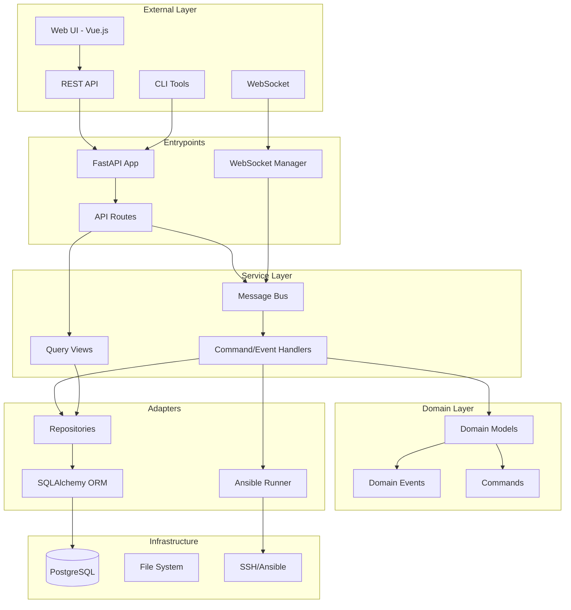
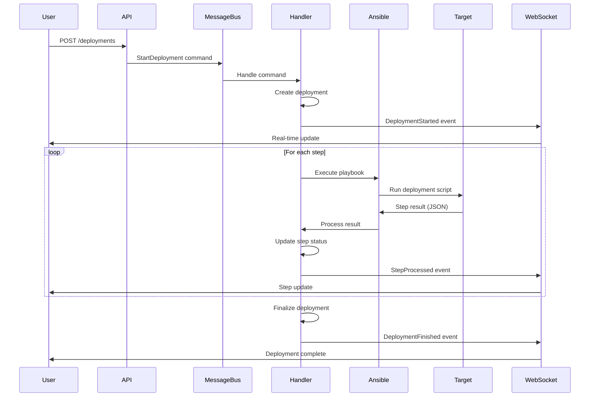
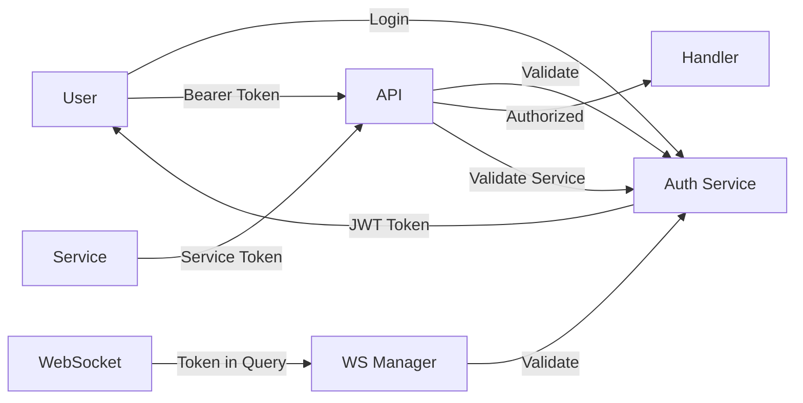

# fastDeploy Architecture

## Overview

fastDeploy is a deployment automation platform built with modern software architecture patterns that enable both technical and non-technical users to deploy web applications reliably and efficiently. The system follows Domain-Driven Design (DDD) principles, implements event-driven architecture patterns, and maintains a clean separation of concerns across all layers.

## System Architecture

### High-Level Design

fastDeploy follows a **Hexagonal Architecture** (Ports and Adapters) pattern, organizing code into distinct layers with clear boundaries and dependencies that flow inward:



### Technology Stack

#### Backend Stack
- **Framework**: FastAPI - Modern async Python web framework with automatic OpenAPI documentation
- **Database**: PostgreSQL with asyncpg for high-performance async database access
- **ORM**: SQLAlchemy 2.0 with imperative mapping for clean domain model separation
- **Message Bus**: Custom async message bus for command and event handling
- **Deployment**: Ansible playbooks for infrastructure automation
- **Testing**: pytest with comprehensive async support and fixtures

#### Frontend Stack
- **Framework**: Vue.js 3 with Composition API for reactive UI components
- **Build Tool**: Vite for fast development and optimized production builds
- **State Management**: Pinia stores for centralized state management
- **Real-time**: WebSocket client for live deployment updates
- **HTTP Client**: Custom client built on mande with authentication interceptors
- **Testing**: Vitest for component and integration testing

#### Infrastructure
- **Process Management**: Justfile for task automation (migrating from Honcho)
- **Code Quality**: Ruff (linting + formatting), mypy (type checking), pre-commit hooks
- **Documentation**: MkDocs with Material theme
- **Packaging**: UV build backend for modern Python packaging

## Core Design Patterns

### Domain-Driven Design (DDD)

fastDeploy implements DDD with rich domain models that encapsulate business logic:

#### Aggregates
The domain layer contains several key aggregates, each maintaining its own consistency boundary:

- **User**: Manages authentication, tokens, and permissions
- **Service**: Defines deployable applications with their configuration
- **Deployment**: Orchestrates the deployment process and tracks state
- **Step**: Represents individual deployment actions within a deployment
- **DeployedService**: Tracks the relationship between services and their deployments

#### Domain Events
All aggregates inherit from `EventsMixin`, providing event recording capabilities:

```python
class EventsMixin:
    def record_event(self, event: Event):
        """Record a domain event for later processing"""
        self.events.append(event)
```

Events capture all significant state changes:
- `UserCreated`, `UserUpdated`, `UserDeleted`
- `ServiceCreated`, `ServiceUpdated`, `ServiceDeleted`
- `DeploymentStarted`, `DeploymentFinished`, `DeploymentFailed`
- `StepProcessed`, `StepUpdated`

### Event-Driven Architecture

#### Command-Query Responsibility Segregation (CQRS)

The system separates read and write operations:

**Commands** (Write Operations):
- `CreateUser`, `UpdateUser`, `DeleteUser`
- `CreateService`, `UpdateService`, `DeleteService`
- `StartDeployment`, `ProcessStep`, `FinishDeployment`

**Queries** (Read Operations):
- Handled through dedicated view functions
- Optimized read models for different use cases
- No side effects on domain state

#### Message Bus Pattern

The message bus provides centralized command and event handling:

```python
class MessageBus:
    async def handle(self, message: Message):
        """Route messages to appropriate handlers"""
        queue = [message]
        while queue:
            message = queue.pop(0)
            if isinstance(message, Command):
                await self.handle_command(message)
            elif isinstance(message, Event):
                await self.handle_event(message)
            queue.extend(self.uow.collect_new_events())
```

Benefits:
- Decoupled components
- Asynchronous processing
- Event cascading support
- Transaction boundary management

### Repository Pattern

Abstract repositories provide a collection-like interface for domain objects:

```python
class AbstractServiceRepository(ABC):
    @abstractmethod
    async def add(self, service: Service) -> None:
        """Add a service to the repository"""

    @abstractmethod
    async def get(self, id: int) -> Service:
        """Retrieve a service by ID"""

    @abstractmethod
    async def get_by_name(self, name: str) -> Service:
        """Retrieve a service by name"""
```

Multiple implementations support different scenarios:
- `SqlAlchemyServiceRepository`: Production persistence
- `InMemoryServiceRepository`: Testing and development
- `TestableServiceRepository`: Controlled testing scenarios

### Unit of Work Pattern

The Unit of Work pattern manages transactions and coordinates repositories:

```python
class AbstractUnitOfWork:
    async def __aenter__(self):
        return self

    async def __aexit__(self, *args):
        await self.rollback()

    async def commit(self):
        """Commit the transaction"""

    async def rollback(self):
        """Rollback the transaction"""

    def collect_new_events(self):
        """Collect events from all repositories"""
```

Features:
- Atomic operations across multiple repositories
- Automatic event collection
- Transaction lifecycle management
- Consistent error handling

### Dependency Injection

The bootstrap system provides flexible dependency injection:

```python
def bootstrap(
    use_fake_email: bool = False,
    use_in_memory: bool = False,
    use_testable: bool = False,
) -> MessageBus:
    """Configure and wire up the application dependencies"""
```

This enables:
- Environment-specific configurations
- Easy testing with mock implementations
- Clean separation of concerns
- Runtime dependency resolution

## Frontend Architecture

### Component Architecture

Vue.js components are organized by feature:

```
frontend/src/
├── components/           # Reusable UI components
│   ├── ServiceList.vue
│   ├── ServiceDetail.vue
│   ├── DeploymentList.vue
│   ├── DeploymentDetail.vue
│   └── WebsocketStatus.vue
├── stores/              # Pinia state stores
│   ├── auth.js         # Authentication state
│   ├── deployment.js   # Deployment management
│   ├── service.js      # Service management
│   └── websocket.js    # WebSocket connection
└── views/              # Page-level components
    ├── Home.vue
    ├── Login.vue
    └── Dashboard.vue
```

### State Management

Pinia stores provide centralized state management with a clean API:

```javascript
export const useDeploymentStore = defineStore('deployment', {
    state: () => ({
        deployments: [],
        currentDeployment: null,
        loading: false
    }),

    actions: {
        async fetchDeployments() {
            // Fetch deployments from API
        },

        handleWebSocketUpdate(data) {
            // Process real-time updates
        }
    }
})
```

### Real-time Communication

WebSocket integration provides live deployment updates:

```javascript
class WebSocketClient {
    connect(token) {
        this.ws = new WebSocket(`${WS_URL}?token=${token}`)
        this.ws.onmessage = this.handleMessage
    }

    handleMessage(event) {
        const data = JSON.parse(event.data)
        // Dispatch to appropriate store
    }
}
```

## Deployment Architecture

### Service Definition

Services are defined through JSON configuration files:

```json
{
    "name": "my-app",
    "description": "My Application",
    "deploy_script": "deploy.sh",
    "steps": [
        {"name": "prepare", "description": "Prepare environment"},
        {"name": "deploy", "description": "Deploy application"},
        {"name": "verify", "description": "Verify deployment"}
    ]
}
```

### Deployment Flow



### Deployment Execution

Deployments are executed through configurable scripts:

1. **Script Configuration**: Services define their deployment script
2. **Step Definition**: Steps can be defined in service.json or extracted from Ansible playbooks
3. **Script Execution**: Deploy script runs with deployment context
4. **Progress Reporting**: Scripts report step completion via API
5. **Status Updates**: Real-time updates sent via WebSocket

## Security Architecture

### Authentication & Authorization

#### Token Types
- **User Tokens**: JWT tokens for user authentication
- **Service Tokens**: Long-lived tokens for service-to-service communication
- **Deployment Tokens**: Short-lived tokens for deployment operations

#### Security Flow


### Authentication & Deployment Security

- No SSH keys stored in the application
- Deployment scripts receive JWT tokens for API authentication
- SSH_AUTH_SOCK environment variable passed through if available
- Relies on host system SSH configuration

## Testing Strategy

### Backend Testing

#### Test Pyramid
1. **Unit Tests**: Domain logic, pure functions
2. **Integration Tests**: Repository, database interactions
3. **E2E Tests**: API endpoints, full request cycle
4. **System Tests**: Complete deployment workflows

#### Test Infrastructure
```python
@pytest.fixture
async def uow():
    """Provide a test unit of work with in-memory repositories"""
    return InMemoryUnitOfWork()

@pytest.fixture
async def client(app):
    """Provide a test HTTP client"""
    async with AsyncClient(app=app) as client:
        yield client
```

### Frontend Testing

#### Component Testing
```javascript
describe('ServiceList', () => {
    it('displays services', async () => {
        const wrapper = mount(ServiceList, {
            props: { services: mockServices }
        })
        expect(wrapper.findAll('.service-item')).toHaveLength(3)
    })
})
```

#### Store Testing
```javascript
describe('DeploymentStore', () => {
    it('updates deployment status', () => {
        const store = useDeploymentStore()
        store.updateDeploymentStatus(deploymentId, 'completed')
        expect(store.currentDeployment.status).toBe('completed')
    })
})
```

## Performance Considerations

### Database Optimization
- Connection pooling with asyncpg
- Prepared statements for frequent queries
- Index optimization for common access patterns
- Query result caching where appropriate

### Async Processing
- Non-blocking I/O throughout the stack
- Concurrent request handling
- Background task processing
- WebSocket connection pooling

### Frontend Optimization
- Code splitting for lazy loading
- Component-level caching
- Virtual scrolling for large lists
- Optimistic UI updates

## Observability

### Metrics
- Deployment success/failure tracking in database
- Step execution status tracking
- WebSocket connection status for real-time updates

## Scalability Considerations

### Current Implementation
- Async I/O throughout the stack with FastAPI and asyncpg
- Database connection pooling
- WebSocket connection management
- Stateless API design allowing multiple instances

### Performance Features
- Non-blocking database operations
- Efficient query patterns with SQLAlchemy
- Async command and event processing
- Concurrent request handling
