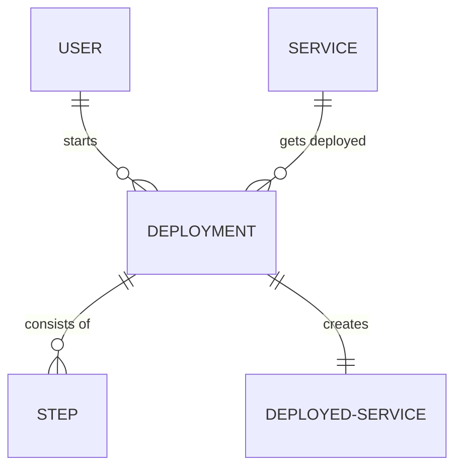

# Data Model

The data model for fastdeploy is quite simple. There are only
four tables:

1. Users
1. Services
1. Deployments
1. Steps

## User

If you want to be able to log in to the web frontend, you need a
user account which get's stored in the User table. There are some
actions you can only do while authenticated as user:

* Add a new service
* Get an authentication token for a service

## Service

Services are the things that you want to deploy. They are stored in the
Service table. They have a name and a json configuration. The configuration
defines how a service should be deployed.

Services can authenticate themselves with a service token. This token
has an origin to make visible which party used it to authenticate as
a service (for example GitHub). Those tokens can be used to start a
deployment for a service.

For example as a user you can get a service token via the web frontend,
set it's origin to GitHub and then store it in the secrets of a GitHub
project which then runs an GitHub action that uses this token to start
a deployment for this service on push to a particular branch.

## Deployment

Deployments are what fastdeploy is all about. They have a service and
a user (which usually created the service token to start the deployment
or started the deployment manually). Deployments store when they were
started and finished.

A deployment has a list of steps that have to be taken to deploy the
service.

## Step

A step is a single step in a deployment. It has a name and stores when
it was started and finished. It also has a state and a message which
get's displayed to the user.

If you know about ansible, you can think of steps as ansible tasks and
deployments as ansible playbooks.

## Deployed Service

Some services like `apt upgrade` just get deployed and that's about it.
But sometimes a deployment results in a deployed service which is running
and can be stopped, monitored or backuped. Information about those services
is stored in the DeployedService table. DeployedServices are linked to the
Deployment they were created by.

# ER-Diagram

