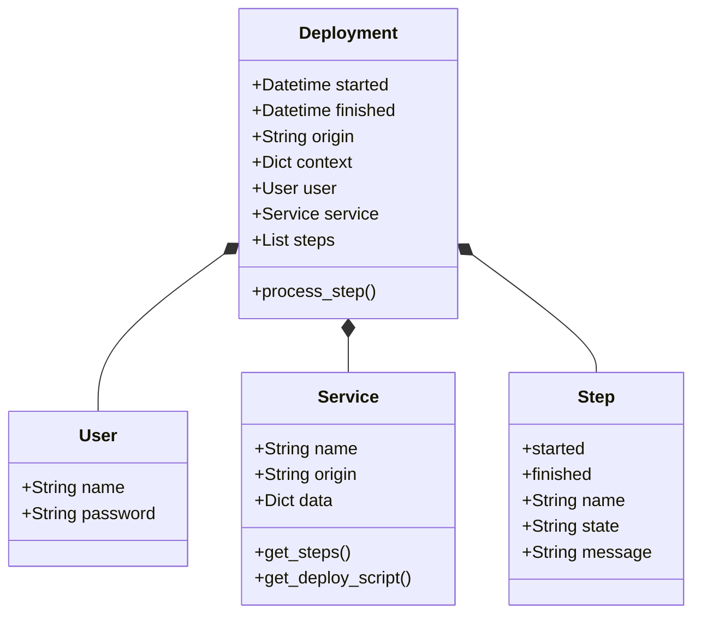

# Class Diagram

```mermaid
classDiagram
    class User{
      +String name
      +String password
    }
    class Deployment{
        +Datetime started
        +Datetime finished
        +String origin
        +Dict context
        +User user
        +Service service
        +List<Step> steps
        +process_step()
    }
    Deployment *-- User
    Deployment *-- Service
    Deployment *-- Step
    class Service{
      +String name
      +String origin
      +Dict data
      +get_steps()
      +get_deploy_script()
    }
    class Step{
      +started
      +finished
      +String name
      +String state
      +String message
    }
```
